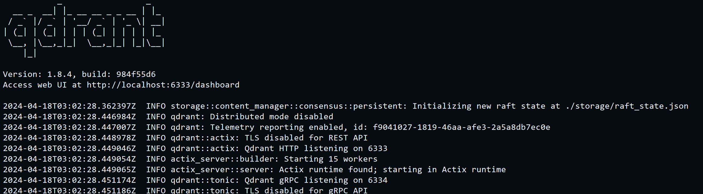

# Searching for Similar Vectors/Entries for Game Cards with Rust Qdrant

## Description
In this project, we used the Rust Qdrant client to upload card entries and find the most similar card based on vector values provided by the user. The card entries were originally added to the vector database with a payload, the card details itself, and the corresponding vector, which is a dimension of 10 for this mini project. The user runs the commands and inputs the vector values from the terminal to obtain the most similar cards (via a distance search with the vectors corresponding to the cards).

[Click Here for this Project's Overview Demo Video!!!](https://www.youtube.com/watch?v=qH0y7nni5TI)

## Why opt for qdrant in rust?

Rust is incredibly fast and efficient, and the Qdrant documentation supported rust. The only drawback is that the printing mechanisms for the rust output are aesthetically displeasing.

## Usage

Adjust the points added to the vector database to house your entries or files or information, as well as adjust the vector dimensions to encode more information.

## Quick Usage

To use the demo run the code quickly and directly, run the following

```
# local
$ make local-run

# This command contains the following, from the rust documentation
dockersetup:
    cd ygenvmp7 &&\
            cargo add qdrant-client anyhow tonic tokio serde-json --features tokio/rt-multi-thread &&\
                docker run -p 6333:6333 -p 6334:6334 -e QDRANT__SERVICE__GRPC_PORT="6334" qdrant/qdrant

# And the rest to run the project
install:
	# assumes you installed rust
	cd ygenvmp7 &&\
		cargo clean &&\
			cargo build &&\
				cargo run
```

## Setup Instructions

1. Run the docker commands from the rust documentation for Qdrant. This will run the client locally. Leave this running in a separate terminal session.
```
$ docker run -p 6333:6333 -p 6334:6334 -e QDRANT__SERVICE__GRPC_PORT="6334" qdrant/qdrant
```

2. Make a directory for the project and navigate inside it. Then add the Qdrant specific dependencies.
```
$ cargo new your_project
$ cd your_project
$ cargo add qdrant-client anyhow tonic tokio serde-json --features tokio/rt-multi-thread 
```

3. For the logic, I simply added a few vectors of information by using the documentation. The more difficult part was parsing out the content from the user into a vector.
```
use std::io;

#[tokio::main]
async fn main() -> Result<()> {
    (...ellided...)
    let points = vec![
        PointStruct::new(
            1,
            vec![0.05, 0.61, 0.76, 0.74, 0.19, 0.81, 0.75, 0.11, 0.19, 0.81],
            json!(
                {"card": "DarkMagician", "series": "Yu-Gi-Oh!"}
            )
            .try_into()
            .unwrap(),
        ),
        PointStruct::new(
            2,
            vec![0.19, 0.81, 0.75, 0.11, 0.19, 0.52, 0.38, 0.27, 0.78, 0.99],
            json!(
                {"card": "BlitzGreymon", "series": "Digimon"}
            )
            .try_into()
            .unwrap(),
        ),
        PointStruct::new(
            3,
            vec![0.29, 0.31, 0.52, 0.11, 0.19, 0.25, 0.38, 0.27, 0.78, 0.99],
            json!(
                {"card": "Bolshack Yamato Dragon", "series": "Duel Masters"}
            )
            .try_into()
            .unwrap(),
        ),
    ];
    
    (...ellided to highlight parsing...)
    let mut search_vector = Vec::new();

    println!("Enter values for the search vector (10 values expected):");

    // Read 10 values from the user
    for _ in 0..10 {
        let mut input = String::new();
        io::stdin().read_line(&mut input).expect("Failed to read line");
        let value: f32 = input.trim().parse().expect("Invalid input");
        search_vector.push(value);
    }

    // Perform the search with the user-provided search vector
    let search_result = client
        .search_points(&SearchPoints {
            collection_name: "test".to_string(),
            vector: search_vector,
            limit: 3,
            with_payload: Some(true.into()),
            ..Default::default()
        })
        .await?;
```

4. While the client is running, simply build and run the project. Then try to place user input.
```
$ cargo build
$ cargo run
```
Running the client:



Running the project and seeing the prompt for user input.


5. Inspect the output and assess the similarities for your input vector. You will find that some cards match your vector more than others. 

## Result

For this demonstration, the most similar card to the demonstration vector was Bolshack Dragon from Duel Masters, an old cartoon series from the 2000s. 


## Licenses
Creative Commons.

## Status
This project is complete as of April 2024.
